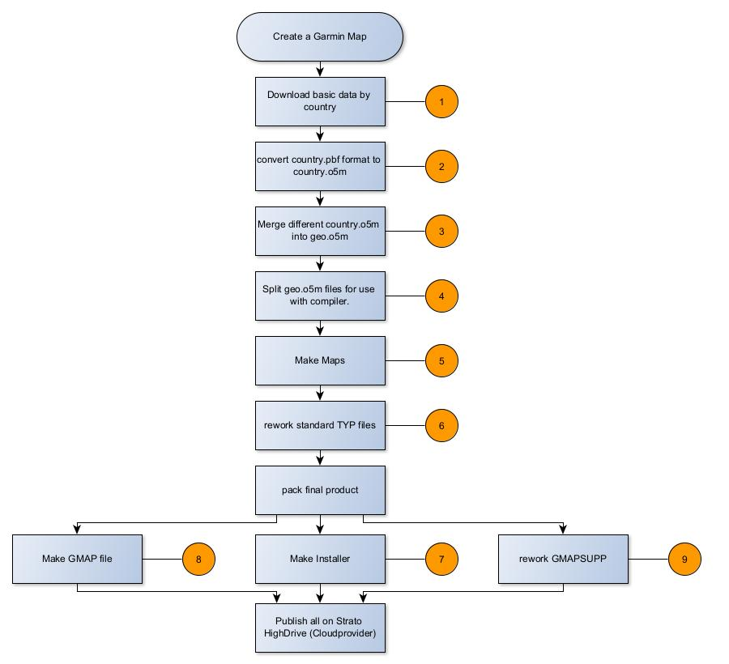

# gravelmaps.de
Documentation of the Garmin Maps for Offroad Adventures published on https://gravelmaps.de .  
The maps have a focus for motorcycle / enduro / off-road purpose. 

There are 2 styles:
1) offroad. This is the standard map
2) oruxmaps. This map is used for Android devices with OruxMaps as the navigation app.

## Overview

The diagram shows how the maps are created. The following sections will tell you what tools are used and what supporting files are needed to create the map. Some files you will need to download, others you will need to create yourself.

### Tools
The numbers relate to the numbers in the diagram. All links refer to windows programs.

| Number | Tool | Link to origin |
| --- | --- | --- |
| 1 | wget | https://sourceforge.net/projects/gnuwin32/files/wget/ |
| 2 | OSMconvert | https://wiki.openstreetmap.org/wiki/Osmconvert |
| 3 | OSMconvert | see above  |
| 4 | Splitter | https://www.mkgmap.org.uk/download/splitter.html |
| 5 | MkGMAP | https://www.mkgmap.org.uk/download/mkgmap.html |
| 6 | gmt.exe | https://www.gmaptool.eu/ |
| 7 | NSISbi (must be 64bit Version due to the size of the output files) | https://sourceforge.net/projects/nsisbi/ |
| 8 | 7Z | https://www.7-zip.org/ |
| 9 | gmt.exe | see above  |
|  |  |  |

Additional Tools for preparation before you start compiling:

| What for? | Tool | Link to origin |
| --- | --- | --- |
| In case you want to make contour lines | hgt2osm | hgt2osm (https://github.com/FSofTlpz/Hgt2Osm2) |
|  | srtm2osm | https://wiki.openstreetmap.org/wiki/Srtm2Osm |
|  | phyghtmap | http://katze.tfiu.de/projects/phyghtmap/ |
| To prepare your TYP files | TYPWiz | https://www.pinns.co.uk |
| In order to run the compilation in an automated way, use  |  00_Make_Maps.py 00_Make_Maps.json 00_Make_Maps.cmd | this github repository | 

### Supporting files needed 
The numbers relate to the numbers in the diagram.

| Number  | what's done | Supporting file | where to get |
| ---  | --- | --- | --- |
| In advance of compile | Prepare DEM data | My favourite and best available free elevation data for Europe: Sonny' LiDAR Digital terrain models of Europe (Digital Terrain Model DTM based on precise LiDAR height sources) |  https://sonny.4lima.de/ |
|  |  |30-Meter SRTM Tile Downloader (Nasa Earth Data)  |  https://dwtkns.com/srtm30m/ |
|  |  | If you search for areas not handled by the two sites above | https://viewfinderpanoramas.org/dem3.html |
|  |  | A resource to find other resources | https://www.imagico.de/map/demsearch.php |
| 1 | Download Geodata.  Has pbf format.  |  | https://download.geofabrik.de/ |
| 2 | Convert every "country.pbf" to "country.o5m" for use in next step. |  |  |
| 3 | Merge all country.o5m into a geo.o5m |  |  |
| 4 | Split the "geo.o5m" to be used for compile. | CITIES  | https://download.geonames.org/export/dump/  |
|  |  | sea-latest  | https://www.thkukuk.de/osm/data/sea-latest.zip |
| 5 | Compile the map | sea-latest | see above |
|  |  | bounds-latest | https://www.thkukuk.de/osm/data/bounds-latest.zip |
|  |  | The style. The master logic of **what** the map will display and **when**. | this github repository | 
|  |  | Your Copyright definition text file | this github repository |
|  |  | Your Licence file | this github repository |
|  |  | Your Options File. Tells the MKGMap compiler what to do. | You prepare. or 00_Make_Maps.py will create one for you. |
|  |  | roadNameConfig.txt Tells MKGMap how to handle roadnames. | An example is provided with the MKGMap compiler. |
| 6 | rework TYP files to match map Family number. (Needed as well in 7,8,9) | The Typ files describe **how the map looks like**. | this github repository |
| 7  | Pack the former compiled data to a windows installer   | no special files |  |
| 8 | Pack the former compiled data to a GMAPI (New Garmin Map format) | no special files |  |
| 9 | Rework the gmapsupp.img and inject the right "Garmin map name" and "Family number". | no special files |  |
|  |  |  |  |
|  |  |  |  |

## STYLE and TYP
In the STYLE, what you choose to be displayed must find a corresponding equivalent in the TYP file. 
So, while the STYLE describes what is displayed (streets, points, polygones) and when (depending on the zoom level), the TYP file decides how it looks like. 

### TYP Files

You find 5 different TYP files in the following design:
| TYP file | description |
| --- | --- |
| grvl_p.typ | This is the standard to be used with the Garmin image for the Garmin device = gmapsupp.img  This version uses wider roads so that they can be recognised more quickly on the Garmin display. |
| grvl_pB.typ | Same layout as grvl_p.typ but highlights borders. Spin off from Covid times. Sometimes helpful. |
| grvl_pn.typ | Same layout as grvl_p.typ, but uses smaller lines for roads. This is the default for the installer to use with Basecamp. This layout gives good visibility on your computer screen. |
| grvl_pnb.typ | Narrow lines for computer display with highlighted borders. |
| orux.typ | Special layout for the maps to be used with Android devices running OruxMaps. |
|  |  |

### STYLE

